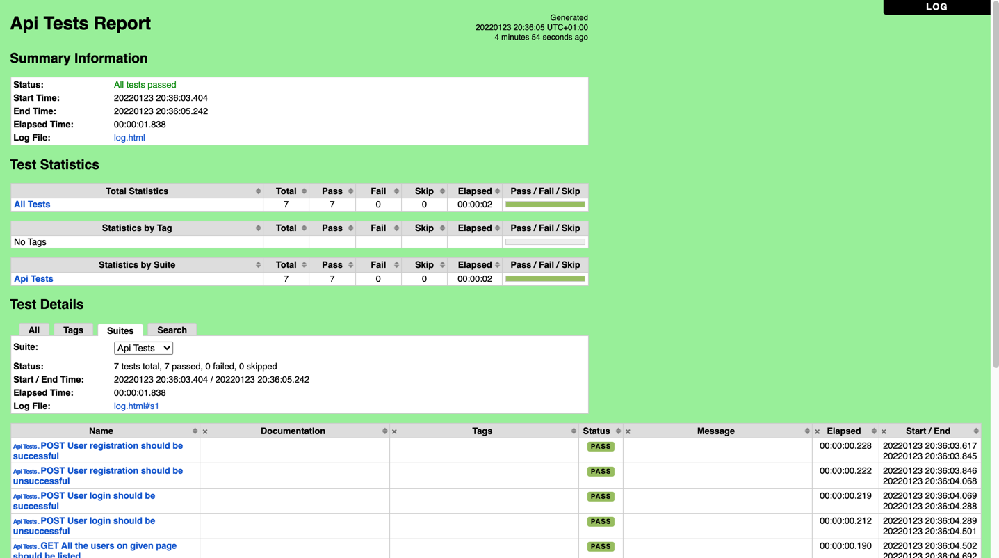

## SUT (system or subject under test)
https://reqres.in/

## Execution process
1. Install python 3.9 from https://www.python.org/downloads/
2. Install robotframework with command "pip install robotframework"
3. Install robotframework requests library for API calls with command "pip install robotframework-requests"
4. execute test suite with command "robot api_tests.robot"
5. Finally test results can be referred in terminal output and log.html after execution is finished

